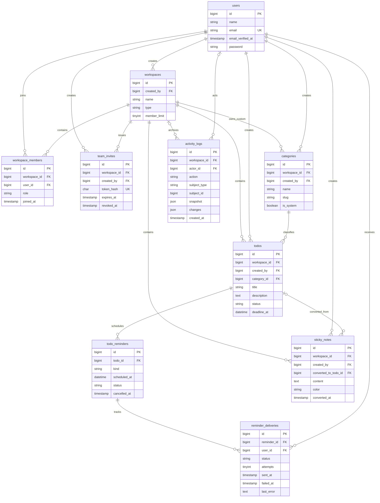

# ERD Backend To Do List KAI

Diagram ini mengikuti migration yang aktif per 31 Juli 2026. Kalender tidak
memiliki tabel tersendiri; event kalender dibentuk dari `todos.deadline_at`.

## Constraint penting

- Satu user hanya satu kali menjadi anggota workspace yang sama.
- Satu kode tim aktif disimpan sebagai SHA-256 hash; kode mentah hanya muncul
  pada response saat dibuat.
- Satu delivery hanya boleh ada sekali untuk pasangan reminder dan user.
- Kategori yang sedang dipakai task memakai foreign key `RESTRICT`.
- Penghapusan workspace menghapus data operasional, tetapi foreign key activity
  log menjadi `NULL` agar snapshot arsip tetap ada.
- Deadline dan waktu reminder disimpan UTC; boundary input/output memakai
  `Asia/Jakarta`.
